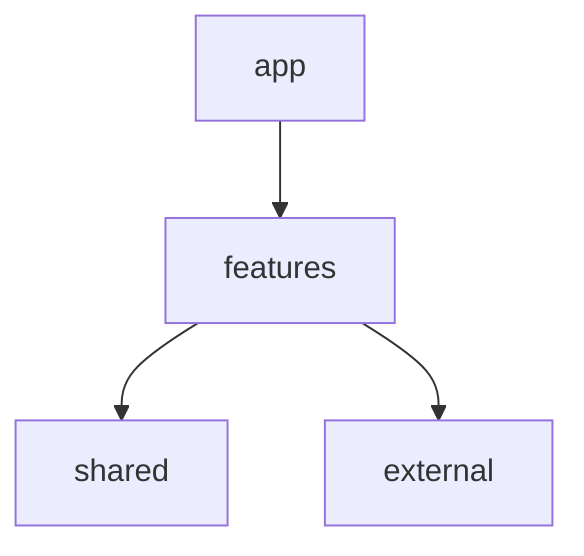
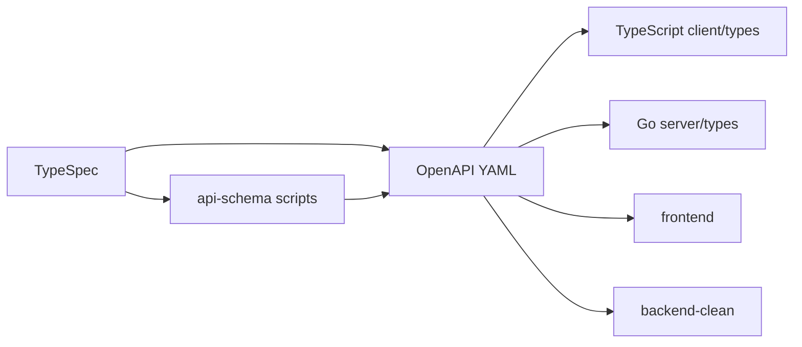

# immortal-architecture-clean

Mini Notion（設計メモを固定フォーマットで残す）を題材に、要件から実装までを揃えた教材/デモです。  
フロントエンド・バックエンド（Clean/Bad）・API契約・設計ドキュメントが同居します。

## Overview

- 設計メモを固定フォーマットで記録・検索・再利用するMVPを想定
- ドキュメント（要件〜API設計）と実装を一体で学べる構成
- Clean Architecture とアンチパターンを比較できる教材付き

## Directory Structure

```
.
├─ docs/                  # 要件・設計ドキュメント（全体設計）
├─ frontend/              # Next.js App Router フロントエンド
├─ backend-clean/         # Clean Architecture 実装（Go）
├─ backend-bad/           # アンチパターン実装（教材用）
├─ api-schema/            # TypeSpec -> OpenAPI/TS 生成
├─ proto/                 # gRPC Proto 定義
├─ compose.yml            # ローカル開発用 Docker Compose
└─ immortal-architecture-clean.code-workspace
```

## Architecture (Mermaid)

```mermaid
graph TD
  Docs[docs/global_design] --> FE[frontend]
  Docs --> BE[backend-clean]
  Docs --> API[api-schema]
  API --> FE
  API --> BE
  FE --> Auth[NextAuth (Google OAuth)]
  FE --> External[external layer]
  External --> BE
  BE --> DB[(PostgreSQL)]
  BE -. compares .-> BAD[backend-bad]
```





## Frontend Design Points

- **レイヤ分離**: `app/`（ルーティング） / `features/`（機能） / `shared/`（共通） / `external/`（外部連携）
- **Server Components 優先**: クライアントJSを最小化し、必要箇所のみ Client Components
- **型安全性**: TypeScript + Zod で入出力の型を保証
- **外部連携の変更耐性**: `external/` に API/DB 依存を隔離して変更に強くする
- **状態管理**: TanStack Query を中心にサーバー状態を扱う

詳細は `frontend/docs/` を参照してください。

## Setup (Local)

セットアップは下記のドキュメントに集約しています。まずは backend-clean のローカルセットアップを参照してください。

- `backend-clean/docs/05_local_setup.md`（Docker Compose / OpenAPI 生成 / マイグレーション）
- `frontend/README.md`（フロントエンド開発サーバー）
- `api-schema/README.md`（TypeSpec から OpenAPI/TS 生成）

## Development Flow (Quick)

1. API定義からOpenAPI生成  
   `api-schema/README.md` の `pnpm run generate:openapi`
2. backend-clean でコード生成/起動  
   `backend-clean/docs/05_local_setup.md` の `make oapi` と `docker compose up -d`
3. フロント起動  
   `frontend/README.md` の `pnpm dev`（または npm/yarn/bun）

## Docs Index

- 全体設計: `docs/global_design/`
- フロントエンド仕様: `frontend/docs/README.md`
- バックエンド（Clean Architecture）: `backend-clean/docs/README.md`
- アンチパターン教材: `backend-bad/docs/README.md`
- APIスキーマ: `api-schema/README.md`
